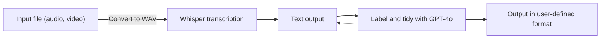

Transcription with OpenAI's [Whisper](https://github.com/openai/whisper) is very accurate, but it doesn't natively support speaker labelling (diarisation). 

Existing libraries for diarisation like [pyannote](https://github.com/pyannote/pyannote-audio) rely on audio features to separate and identify speakers, but are computationally expensive and often inaccurate. A common failure mode arises when the speaker changes their audio quality, such as when they move closer to or further from the microphone. This can cause the diarisation algorithm to incorrectly identify the speaker as a new person.

I had a simple hypothesis: the cues from transcribed speech are sufficient to identify speakers. I developed a pipeline which passes the transcribed text to GPT-4o with a prompt asking it to identify the speaker.


# Features
- Transcribe long media files with Whisper faster using parallel processing.
- Automatically label speakers in the transcription using GPT-4o.
- Tidy up the transcription by removing filler words and false starts.
- Generate timestamped transcripts in plaintext and JSON format.

# Installation

```bash
pip install precisetranscribe
```

Ensure `OPENAI_API_KEY` is set in your environment variables. Then simply run:

```python
import precisetranscribe as pt

```
